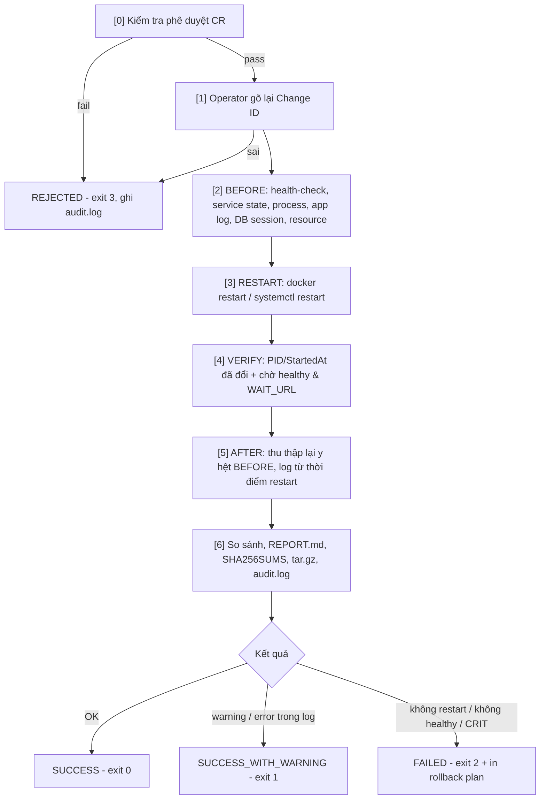

# 07 - App Operations: Health-check & Approved Restart

Lab vận hành ứng dụng trên stack có sẵn (`apps/backend` Flask + PostgreSQL).

| Unit | Nội dung | Tiêu chí | Công cụ |
|---|---|---|---|
| **3** | Health-check ứng dụng | Kiểm tra đúng service / process / URL / port và DB session / tablespace cơ bản | [healthcheck.sh](scripts/healthcheck.sh), [simulate.sh](scripts/simulate.sh) |
| **4** | Restart đã duyệt & thu thập log | Restart có phê duyệt, thu thập log BEFORE/AFTER đầy đủ, đúng trình tự | [approved-restart.sh](scripts/approved-restart.sh), [approvals/](approvals/) |

```
07-app-operations/
├── docker-compose.yml        # postgres + backend + tool services (healthcheck/restart/simulate)
├── toolbox/Dockerfile        # bash, curl, psql, procps, docker CLI
├── scripts/
│   ├── healthcheck.sh        # Unit 3
│   ├── simulate.sh           # Unit 3 - tạo sự cố để chứng minh check phát hiện đúng
│   └── approved-restart.sh   # Unit 4
├── approvals/                # Change Request mẫu: approved / pending / expired
├── sql/oracle_checks.sql     # câu lệnh tương đương nếu DB là Oracle
└── evidence/                 # output BEFORE/AFTER của mỗi lần restart (git-ignored)
```

## Khởi động

```powershell
cd 07-app-operations
docker compose up -d --build postgres backend
docker compose ps                     # hc-postgres, hc-backend đều (healthy)
```

> Scripts chạy trong container toolbox nên dùng được trên Windows / macOS / Linux.
> Trên server Linux thật có thể chạy trực tiếp: `SERVICES="nginx" URLS=... bash scripts/healthcheck.sh`.

---

## Unit 3 — Health-check ứng dụng

### Các hạng mục kiểm tra

| # | Hạng mục | Cách kiểm tra | OK / WARN / CRIT |
|---|---|---|---|
| 1 | **Service** | `systemctl is-active` (systemd) hoặc `docker inspect` (state + health + restart count) | running & healthy / starting / stopped, unhealthy |
| 2 | **Process** | `pgrep -f <pattern>` + `ps` (PID, %CPU, %MEM, uptime) | có process / – / không có |
| 3 | **URL** | `curl`: HTTP code, nội dung mong đợi, response time | đúng code+text / chậm > `URL_SLOW_MS` / sai code, sai text, lỗi kết nối |
| 4 | **Port** | TCP connect `/dev/tcp/host/port` | open / – / closed |
| 5 | **DB session** | `pg_stat_activity`: tổng/`max_connections`, theo state, theo user/app, long query, idle-in-transaction, blocked | < 70% / ≥ 70%, long query, idle-tx / ≥ 90%, có session bị block, không connect được |
| 6 | **Tablespace** | `pg_tablespace_size`, size từng DB, top table, `df` data directory | < WARN / ≥ `TS_SIZE_WARN_MB`, disk ≥ 80% / ≥ `TS_SIZE_CRIT_MB`, disk ≥ 90% |

Exit code chuẩn Nagios: `0=OK`, `1=WARNING`, `2=CRITICAL` → tích hợp được vào cron, Zabbix, Nagios, CI.
Toàn bộ target & ngưỡng cấu hình qua biến môi trường (xem `environment` trong [docker-compose.yml](docker-compose.yml)).

### Kịch bản demo

```powershell
# 1) Trạng thái bình thường -> OVERALL: OK (exit 0)
docker compose run --rm healthcheck
docker compose run --rm healthcheck --only db,tablespace     # chỉ check 1 phần

# 2) SERVICE / PROCESS / URL / PORT down -> CRITICAL
docker compose stop backend
docker compose run --rm --no-deps healthcheck                # docker/hc-backend exited, process không chạy, URL lỗi, port 5000 closed
docker compose start backend

# 3) DB SESSION gần đầy (max_connections=30)
docker compose run -d --name sim-sessions simulate sessions 22   # ~77% -> WARN   (27 -> CRIT)
docker compose run --rm healthcheck --only db

# 4) Long query + lock/blocked session
docker compose run -d --name sim-long simulate longquery 1
docker compose run -d --name sim-lock simulate lock
#    đợi > 30s
docker compose run --rm healthcheck --only db                # WARN long query, WARN idle-in-tx, CRIT blocked

# 5) TABLESPACE tăng trưởng
docker compose run --rm simulate bloat 150000                 # ~+180MB -> pg_default WARN (>=150MB)
docker compose run --rm healthcheck --only tablespace
docker compose run --rm simulate bloat 150000                 # chạy lần 2 -> CRIT (>=300MB)

# 6) Dọn dẹp
docker compose run --rm simulate cleanup
docker rm -f sim-sessions sim-long sim-lock
docker compose run --rm healthcheck                           # về lại OK
```

Ví dụ output:

```
== 5. DATABASE SESSION ==
  [  OK  ] Kết nối DB OK: PostgreSQL 16.x, uptime 00:12:41
  [ WARN ] Sessions: 23/30 max_connections (76%) (>= WARN 70)
           Theo state:
             - idle: 22
             - active: 1
           Top user / application / client:
             - app / hc-simulator / 172.18.0.5: 22
  [  OK  ] Không có query chạy quá 30s
...
== SUMMARY ==
  OK=14  WARNING=1  CRITICAL=0  SKIP=0
  OVERALL: WARNING
HC_RESULT=WARNING ok=14 warn=1 crit=0 skip=0
```

---

## Unit 4 — Restart đã duyệt & thu thập log BEFORE/AFTER

### Trình tự (script ép buộc, không bỏ bước)



**Điều kiện phê duyệt** ở bước [0] (file [CR-DEMO-001.env](approvals/CR-DEMO-001.env)):
- Đủ trường: `CHANGE_ID, TITLE, REQUESTED_BY, APPROVED_BY, APPROVAL_STATUS, TARGETS, WINDOW_START, WINDOW_END, ROLLBACK_PLAN`
- `APPROVAL_STATUS=APPROVED`
- `APPROVED_BY` ≠ người thực hiện (`OPERATOR`) — nguyên tắc four-eyes
- Target cần restart nằm trong `TARGETS`
- Thời điểm hiện tại nằm trong `WINDOW_START … WINDOW_END`

### Kịch bản demo

```powershell
# a) CR chưa duyệt -> REJECTED
docker compose run --rm -e OPERATOR=ops.engineer restart -c /approvals/CR-DEMO-002-pending.env -t docker:hc-postgres

# b) CR hết maintenance window -> REJECTED
docker compose run --rm -e OPERATOR=ops.engineer restart -c /approvals/CR-DEMO-003-expired.env -t docker:hc-backend

# c) Target không có trong CR -> REJECTED
docker compose run --rm -e OPERATOR=ops.engineer restart -c /approvals/CR-DEMO-001.env -t docker:hc-postgres

# d) Dry-run: chỉ kiểm tra phê duyệt + thu BEFORE
docker compose run --rm -e OPERATOR=ops.engineer restart -c /approvals/CR-DEMO-001.env -t docker:hc-backend --dry-run

# e) Restart thật (sẽ hỏi gõ lại "CR-DEMO-001")
docker compose run --rm -e OPERATOR=ops.engineer restart -c /approvals/CR-DEMO-001.env -t docker:hc-backend

# Xem kết quả
Get-Content evidence\audit.log
Get-ChildItem evidence -Recurse | Select-Object FullName
```

### Evidence sinh ra cho mỗi lần chạy

```
evidence/
├── audit.log                                  # 1 dòng / lần chạy: thời gian, CR, operator, target, kết quả
├── CR-DEMO-001_hc-backend_20261006_225500.tar.gz
└── CR-DEMO-001_hc-backend_20261006_225500/
    ├── change_request.env      # bản sao CR tại thời điểm thực hiện
    ├── execution.log           # toàn bộ console output có timestamp
    ├── timeline.txt            # thời điểm bắt đầu từng bước [0]..[6]
    ├── before/
    │   ├── 00_collected_at.txt
    │   ├── 01_healthcheck.txt  (+ .exitcode)
    │   ├── 02_service_state.txt / 02_service_inspect.json
    │   ├── 03_process.txt
    │   ├── 04_app.log          # LOG_TAIL dòng gần nhất trước restart
    │   ├── 05_db_sessions.txt
    │   └── 06_resource.txt     # docker stats, uptime, memory, disk
    ├── after/                  # cùng cấu trúc; 04_app.log = log kể từ lúc restart
    ├── diff_healthcheck.txt
    ├── diff_process.txt
    ├── REPORT.md               # bảng BEFORE vs AFTER, timeline, kết quả, rollback plan
    └── SHA256SUMS              # chống chỉnh sửa evidence
```

Trên server systemd: `approved-restart.sh -c cr.env -t systemd:nginx` → dùng `systemctl status/restart` và `journalctl -u nginx --since <restart time>`.

## Dọn dẹp

```powershell
docker compose --profile tools down -v
```
